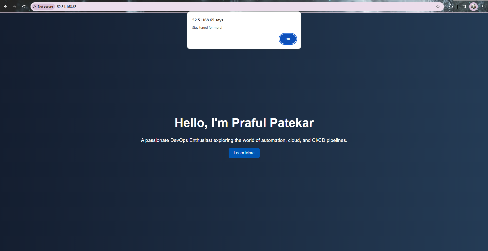

# 🚀 What is Nginx?
Nginx (pronounced "engine-x") is a high-performance, open-source web server and reverse proxy server. It is widely used for load balancing, caching, and serving static content. 🖥️⚡

# 🤔 Why Use Nginx?
✅ Handles high traffic efficiently with low resource usage.
✅ Acts as a reverse proxy to distribute requests to backend servers.
✅ Supports load balancing, security, and caching.
✅ Can serve static files quickly (HTML, CSS, JS, images, etc.).
✅ Used in modern DevOps for microservices and containerized applications. 🔄

# 🔥 One Use Case of Nginx:
In this use case, we will host a simple web page using Nginx as a reverse proxy. 🌐

## 🏗️ Initial Steps: Create an EC2 Instance on AWS
1️⃣ **Login to AWS Console** - Go to [AWS Management Console](https://aws.amazon.com/) and sign in.
2️⃣ **Navigate to EC2** - Search for "EC2" in the AWS dashboard and open it.
3️⃣ **Launch an EC2 Instance** - Click on "Launch Instance" and follow these steps:
   - Choose **Amazon Linux 2** or **Ubuntu**.
   - Select an instance type (e.g., **t2.micro** for free-tier users).
   - Configure security groups: Allow **HTTP (80)** and **SSH (22)**.
   - Add a key pair for SSH access and launch the instance. 🚀

## 🔑 Connect to EC2 Instance
Once the instance is running, connect to it using SSH:
```sh
ssh -i your-key.pem ec2-user@your-ec2-public-ip
```
For Ubuntu instances, use:
```sh
ssh -i your-key.pem ubuntu@your-ec2-public-ip
```

## 🌐 Install & Configure Nginx
1️⃣ **Update and install Nginx**:
```sh
sudo apt update -y && sudo apt install nginx -y   # For Ubuntu
sudo yum update -y && sudo amazon-linux-extras enable nginx1 && sudo yum install nginx -y  # For Amazon Linux 2
```
2️⃣ **Start and enable Nginx**:
```sh
sudo systemctl start nginx
sudo systemctl enable nginx
```

## 🎨 Host a Simple Web Page Using Nginx

1️⃣ **Create `index.html` in `/var/www/html`**:
```sh
sudo vim /var/www/html/index.html
```
2️⃣ **Paste HTML code in `index.html`** - You can use GPT to generate HTML content. After pasting the code, press `Esc`, then type `:wq` to save and exit Vim. 💾

3️⃣ **Restart Nginx to apply changes**:
```sh
sudo systemctl restart nginx
```

4️⃣ **Open Application in Browser** - If your server has HTTP port (80) opened, simply open a new tab and enter your server's public IP, e.g.:
```
http://232.223.22.0:80
```
✅ You should see your hosted web page!

### 🌍 Example Web Page:
